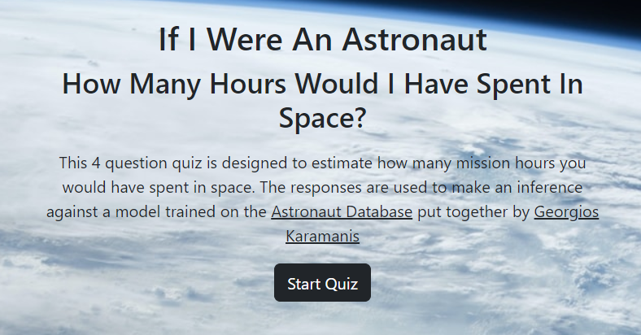
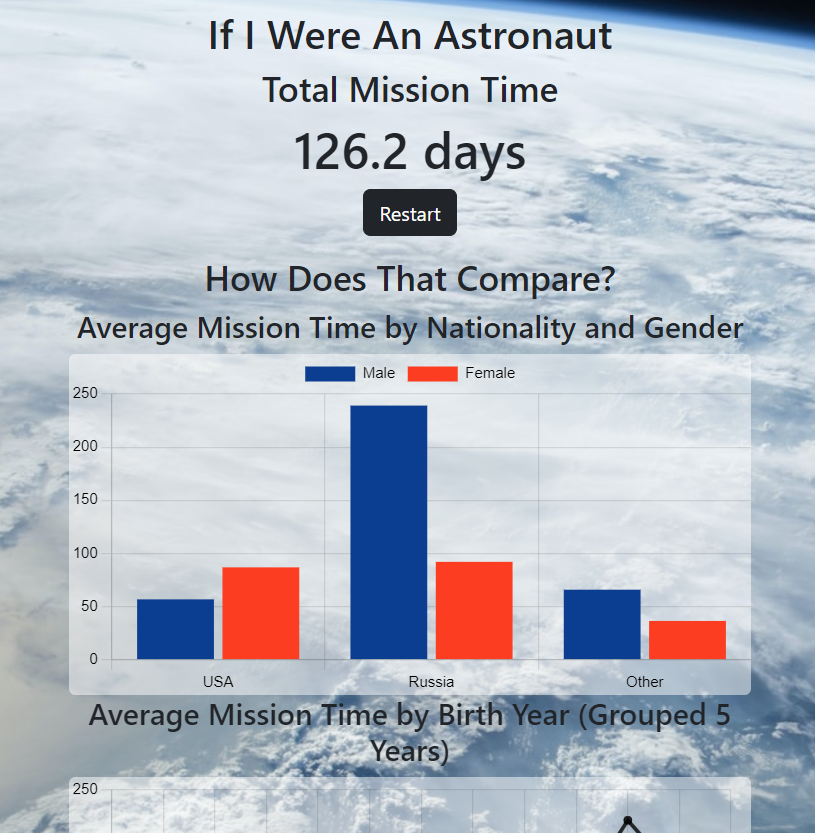

# If I Were An Astronaut Quiz

This project is a web-based quiz that estimates the total mission time an individual would have spent in space based on their responses to a set of questions. The quiz uses a model trained on the Astronaut Database and provides an interactive user interface for inputting information.  

This was built to help me learn how to build in Preact. It follows the no-build-tools route so all packages are utilized via CDN. Python and Flask are used for back end web serving and TPOT used to make a regression model for the dataset. The dataset is available on Kaggle - [Astronaut Database](https://www.kaggle.com/datasets/jessemostipak/astronaut-database).

## Features

- Four-step quiz to gather user information
- Calculates estimated mission time based on user inputs
- Displays total mission time and a comparison chart
- Interactive user interface with intuitive navigation
- Built with Preact for efficient rendering and interactions
- Utilizes Chart.js for chart visualization

## Getting Started

1. Clone the repository
2. Create virtual environment (tested with Python 3.9.6)
3. Pip install offline-requirements.txt (requirements.txt only needed if you are not going to retrain the model)
4. Run offline_train.py to generate a tpot.joblib trained model
5. Run app.py as your web back end (command line flask run or uncomment the last two lines of app.py)
6. Navigate to localhost in your browser

## Usage
1. Start the quiz by clicking the "Start Quiz" button.
2. Follow the steps to provide your year of birth, home country, gender, and age when becoming an astronaut.
3. After completing all steps, your estimated total mission time will be displayed.
4. You can restart the quiz by clicking the "Restart" button.

